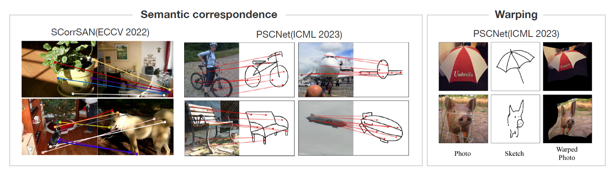
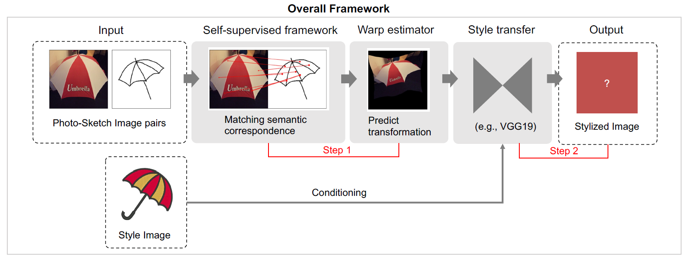
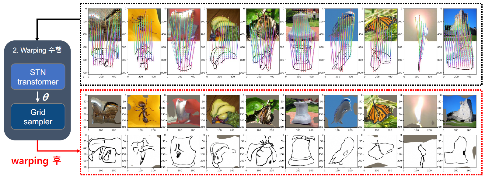
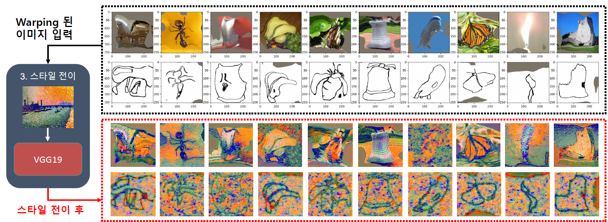
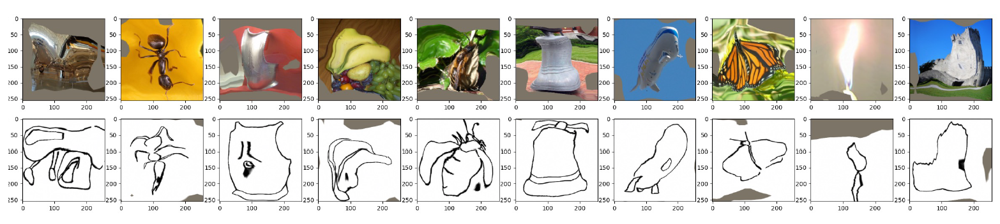
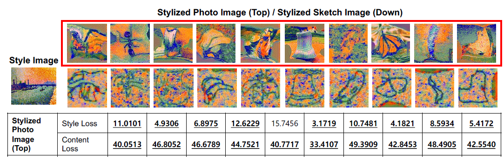

# Style Transfer to Novel Views using Correspondences between Photos and Sketches 

## &#x1F4E2; Project Overview: 2404~2406

### 📄 프로젝트 개요

- 이미지의 시점(구도)을 변환한 후 사용자 취향에 맞춘 스타일 전이를 수행
- 스케치 이미지를 활용해 사용자가 원하는 특정 새로운 시점을 쉽게 표현함
- 이후 스타일 전이를 통해 더욱 개개인의 취향에 커스터마이징한 시각적 콘텐츠를 생성
- 이 기술을 통해 증강 현실(AR), 가상 현실(VR) 등의 환경에서 사용자의 시각적 경험을 향상시키고자 함

### 🎯 프레임워크

1. Semantic Correspondence Point Searching & Image Warping
    - 피처 추출 및 매칭: 사전 학습된 MoCo 인코더를 사용해 사진과 스케치 이미지에서 피처를 추출하고, UV 맵 기반 매칭 수행
    - 이미지 워핑 (Image Warping): Spatial Transformer Network (STN)을 사용해 추정된 코레스폰던스를 기반으로 이미지 워핑

2. Image-to-Image Style Transfer
    - 워핑된 이미지와 스타일 이미지를 VGG19 모델에 입력하여, 사용자 취향에 맞는 최종 stylized image 생성

### 📊 실험 설정
#### 데이터셋
- Photo-Sketchy database from [Link](https://github.com/cogtoolslab/photo-sketch-correspondence/blob/main/PSC6K_Benchmark_README.md)
- Wikiart dataset from [github](https://github.com/cs-chan/ArtGAN/blob/master/WikiArt%20Dataset/README.md) or [kaggle](https://www.kaggle.com/datasets/steubk/wikiart)

#### 평가 지표
- Percentage of Correct Keypoints (PCK): semantic correspondence 매칭 평가 
- KNN accuracy: warping 성능 평가
- VGG Content Loss, VGG Style Loss: 스타일 전이 성능 평가

----

### 📝 실험 결과
1. Quantitative Results:
    - 이미지 워핑: 높은 PCK와 KNN 정확도를 보여, 효과적인 시점 변환을 입증
    - 스타일 전이: VGG Content Loss와 Style Loss를 통해 사진 이미지가 스케치 이미지보다 더 나은 스타일 전이 성능을 보이는 것을 확인
2. Qualitative Results:
    - 스케치와 사진 이미지 간의 효과적인 시맨틱 매칭 확인
    - stylized images에서는 자연스럽고 시각적으로 일관성있는 스타일을 확인함

### 🔍 문제 분석

- 본 방법에서는 Fundamental Matrix 추정의 한계로 인해 시맨틱 코레스폰던스의 정확도가 낮아지는 문제가 있음

- 스케치 이미지는 색상 정보가 부족해 스타일 전이 성능이 낮았음

### 📈 Ablation Study
- Epipolar Constraint Loss: Epipolar 제약 손실을 추가했을 때 시맨틱 매칭이 개선되었지만, Fundamental Matrix 추정 문제로 인해 KNN 정확도가 낮아짐
- 대체 스타일 전이 방법: 색상, 깊이 정보 등의 추가 컨디셔닝 입력을 사용하거나, 다른 스타일 전이 모델을 적용함으로써 성능 향상 기대

### 🚀 향후 연구 방향
- Fundamental Matrix 추정 정확성을 향상시켜 왜곡 문제를 줄이는 방법을 탐구
- 색상 및 깊이 정보와 같은 추가 컨디셔닝 입력을 활용하여 스케치 이미지의 스타일 전이 성능 개선 도모
- 다양한 스타일 전이 모델과 데이터셋을 평가하여 더 넓은 응용 가능성 탐색

----

## 📚 References

[PDF Report](./project_report_final.pdf), 
[PPT Report](./project_report_final_ppt.pdf)

| **Title**                                                                                                                      | **Conference/Journal**        | **Year** |
|-------------------------------------------------------------------------------------------------------------------------------|-------------------------------|----------|
| *"Image Style Transfer Using Convolutional Neural Networks."*                                                                 | CVPR                          | 2016     |
| *"Learning Dense Correspondences between Photos and Sketches."*                                                               | ICML (PMLR)                   | 2023     |
| *"Self-Supervised Learning of Semantic Correspondence Using Web Videos."*                                                     | WACV                          | 2024     |

